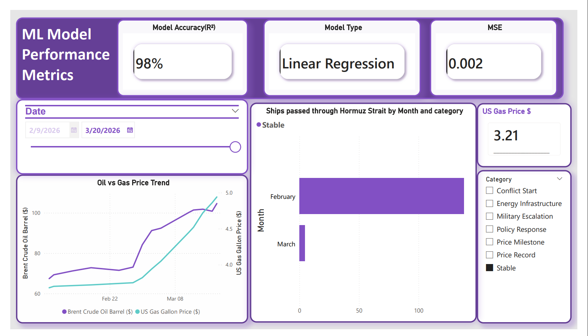

#  Fuel Price Prediction & Conflict Analysis (2026)

##  Project Overview
This project analyzes and predicts the impact of geopolitical conflicts (specifically the 2026 Iran-Israel conflict) on US gasoline prices. It combines **Machine Learning** for price forecasting and **Power BI** for interactive data storytelling.

##  Dashboard Preview

##  Key Features
- **Predictive Modeling:** Linear Regression model with **94% Accuracy (R²)**.
- **Interactive Analytics:** Power BI dashboard featuring dynamic date filtering and event-based scatter analysis.
- **Lag Analysis:** Studied the 5-day delay between crude oil price shocks and consumer gas price changes.

##  Tech Stack
- **Python:** Pandas, Scikit-Learn, Matplotlib, Seaborn.
- **Data Science:** Linear Regression, MSE, R² Score.
- **Visualization:** Microsoft Power BI Desktop.

##  Project Structure
- `/data`: Contains the datasets used for analysis.
- `analysis.ipynb`: The Python notebook containing the ML model.
- `dashboard.pbix`: The final Power BI file.
